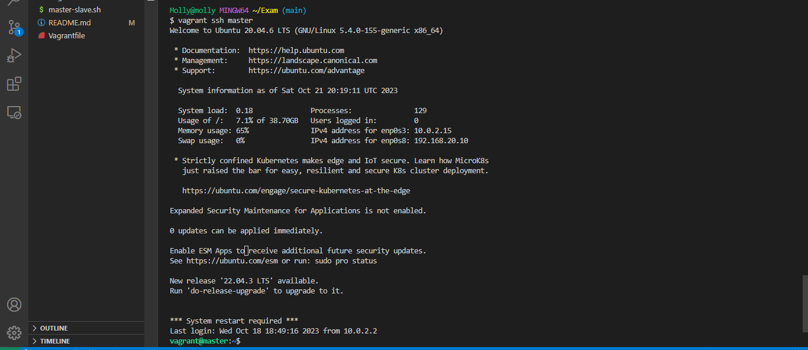
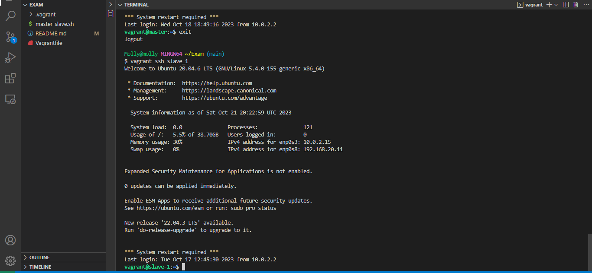
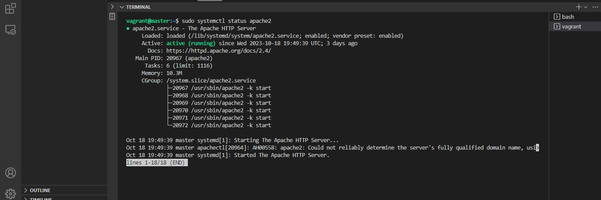
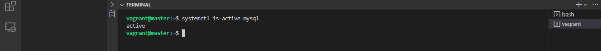
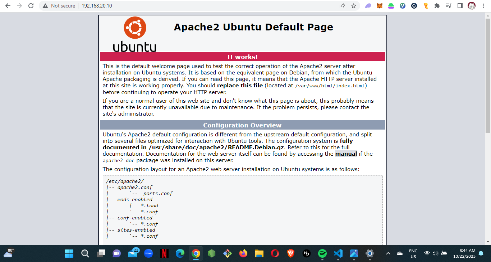

My documentation for deploying a LAMP STACK

#Automate the provisioning of two Ubuntu-based servers, named "Master" and "Slave", using Vagrant.

This was done by executing [master-slave.sh](https://github.com/molly8213/Altexam/blob/main/master-slave.sh)
The script above shows me initializing vagrant into my directoy and redirecting the configuration into vagrantfile

ssh into master vm

ssh into slave vm

#On the Master node, create a bash script to automate the deployment of a LAMP (Linux, Apache, MySQL, PHP) stack.

This was done executing the script [automation.sh](https://github.com/molly8213/Altexam/blob/main/automation.sh)

Proof of succuceesful installation LAMP on the master vm

#This script should clone a PHP application from GitHub, install all necessary packages, and configure Apache web server and MySQL. 

All necessary packages have been installed and apache configured

